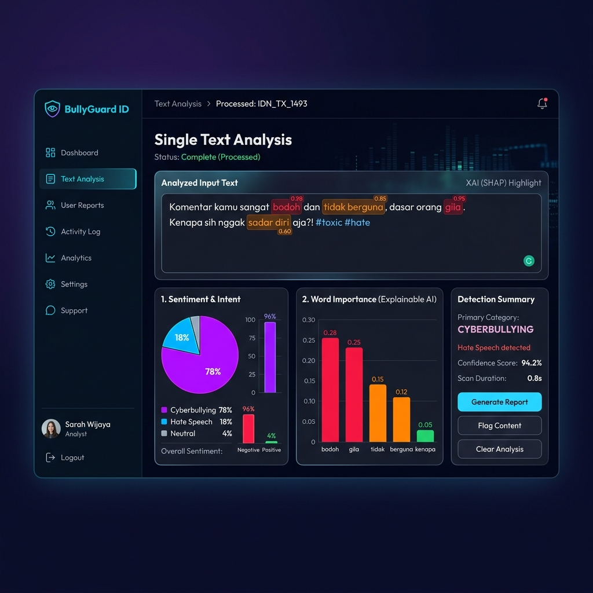

# 💻 Panduan Setup Lokal — BullyGuard ID



Dokumen ini memandu Anda melakukan instalasi dan konfigurasi sistem BullyGuard ID di mesin lokal untuk keperluan pengembangan (*development*).

> [!NOTE]
> Proyek ini menggunakan arsitektur hybrid yang membutuhkan basis data **PostgreSQL** dan cache store **Redis**. Disarankan untuk menjalankan database dan cache menggunakan Docker agar mempermudah konfigurasi.

---

## 📥 1. Kloning Repositori

Buka terminal Anda dan jalankan perintah kloning berikut:

```bash
git clone https://github.com/Maliq-dlt/indonesian-cyberbullying-detection-api.git
cd indonesian-cyberbullying-detection-api
```

---

## 🔑 2. Konfigurasi Variabel Lingkungan (Environment)

Salin berkas template environment yang telah disediakan menjadi berkas aktif `.env`:

**Bagi Pengguna Linux / macOS / Git Bash:**
```bash
cp .env.example .env
```

**Bagi Pengguna Windows PowerShell:**
```powershell
Copy-Item .env.example .env
```

Buka file `.env` baru Anda dan sesuaikan konfigurasi minimal di bawah ini:
```env
ENV=development
API_KEY=rahasia_api_key_anda_yang_panjang_dan_aman
ALLOW_MISSING_API_KEY_IN_DEV=true

# Database & Cache (Jika dikosongkan/tidak aktif, otomatis fallback ke SQLite & Memory Cache)
PG_URL=postgresql://cyber_user:change_this_postgres_password@db:5432/cyberbullying_db
REDIS_URL=redis://:change_this_redis_password@redis:6379/0

# Layanan Cloud LLM Tier 3 (Opsional)
GEMINI_API_KEY=AIzaSy...
GEMINI_BASE_URL=https://generativelanguage.googleapis.com/v1beta/openai
GEMINI_MODEL=gemini-1.5-flash
```

> [!TIP]
> **Zero-Config/Offline Fallback:** Jika Anda sedang tidak menggunakan charger laptop (mode hemat daya) dan mematikan Docker, sistem tetap dapat berjalan lancar. Backend BullyGuard ID akan mendeteksi PostgreSQL/Redis mati secara otomatis dalam waktu singkat (dengan batas timeout 1.5 - 2 detik), lalu mengaktifkan *cooldown* 60 detik (Circuit Breaker) agar request berikutnya tidak menggantung (*hang*) dan langsung membaca/menulis memori klasifikasi pada database lokal SQLite `cyberbullying_api/cache/cloud_llm_cache.db`.


---

## ⚡ 3. Opsi Peluncuran Cepat (Quick Start Runner)

Jika Anda ingin langsung menjalankan Backend API dan Frontend Dashboard secara bersamaan tanpa perlu membuka banyak terminal atau menjalankan perintah secara manual satu per satu:

* **Bagi Pengguna Windows (PowerShell/CMD):**
  Klik ganda berkas `run_local.bat` di root direktori proyek, atau jalankan perintah:
  ```cmd
  run_local.bat
  ```

* **Bagi Pengguna Linux / macOS:**
  Jalankan perintah berikut di terminal root proyek Anda:
  ```bash
  chmod +x run_local.sh
  ./run_local.sh
  ```

*Script di atas akan memeriksa file `.env` secara otomatis, kemudian meluncurkan server uvicorn backend dan vite dev-server frontend secara paralel.*

---

## 🐳 4. Jalankan Database & Cache (Docker)

Nyalakan PostgreSQL (dengan ekstensi `pgvector`) dan Redis di latar belakang menggunakan Docker Compose:

```bash
# Menyalakan container database dan cache secara daemon
docker compose up -d db redis
```

Verifikasi untuk memastikan kedua container telah aktif dan berjalan lancar:
```bash
docker compose ps
```

---

## ⚙️ 5. Setup Backend API

Buka direktori `cyberbullying_api` dan buat *virtual environment* Python khusus:

```bash
cd cyberbullying_api
python -m venv .venv
```

### 🔌 Aktivasi Virtual Environment
Pilih perintah yang sesuai dengan terminal yang Anda gunakan:

- **Windows PowerShell:**
  ```powershell
  .\.venv\Scripts\Activate.ps1
  ```
- **Windows Command Prompt (CMD):**
  ```cmd
  .venv\Scripts\activate
  ```
- **macOS / Linux:**
  ```bash
  source .venv/bin/activate
  ```

### 📦 Pemasangan Dependensi Python
Lakukan upgrade package manager `pip` terlebih dahulu, kemudian pasang dependensi pustaka yang dibutuhkan:

```bash
pip install --upgrade pip
pip install -r requirements.txt
```

### 🚀 Menjalankan Server API
Jalankan server pengembangan FastAPI menggunakan Uvicorn:

```bash
uvicorn main:app --reload --host 0.0.0.0 --port 8000
```
Server kini aktif di `http://localhost:8000`. Anda dapat mengakses dokumentasi API interaktif (Swagger UI) di [http://localhost:8000/docs](http://localhost:8000/docs).

---

## 🖥️ 6. Setup Frontend Web Dashboard

Buka terminal baru di root direktori proyek, lalu masuk ke folder `frontend`:

```bash
cd frontend
npm install
npm run dev
```

Dashboard frontend Anda kini dapat diakses melalui peramban (*browser*) di [http://localhost:5173](http://localhost:5173).

---

## 🧪 7. Pengujian & Penjaminan Mutu (Testing)

### 🐍 Backend Unit Testing
Pastikan *virtual environment* Anda telah aktif di terminal root proyek, kemudian jalankan:
```bash
pytest cyberbullying_api/tests
```

### 🎨 Frontend Linting & Build
Uji build produksi dan kelayakan kode frontend:
```bash
cd frontend
npm run lint
npm run build
```

---

## ❓ 8. Pemecahan Masalah (Troubleshooting)

### ❌ Backend Tidak Bisa Connect ke PostgreSQL
- Pastikan container PostgreSQL aktif. Jalankan `docker compose ps`.
- Periksa log container jika ada error inisialisasi:
  ```bash
  docker compose logs db
  ```

### ❌ Kesalahan Autentikasi Redis
- Pastikan parameter kata sandi (`REDIS_PASSWORD`) pada file `.env` selaras dengan konfigurasi di berkas `docker-compose.yml`.

### ❌ Endpoint Menolak Request (401 Unauthorized)
- Pastikan Anda menyertakan header autentikasi pada setiap HTTP request ke endpoint terlindungi:
  ```text
  X-API-Key: change_me_to_a_long_random_secret
  ```

### ❌ Masalah CORS (Cross-Origin Resource Sharing)
- Jika frontend gagal menghubungi API backend, cek variabel `ALLOWED_ORIGINS` di berkas `.env` dan pastikan domain frontend (`http://localhost:5173` atau `http://localhost:3000`) telah terdaftar secara benar.
